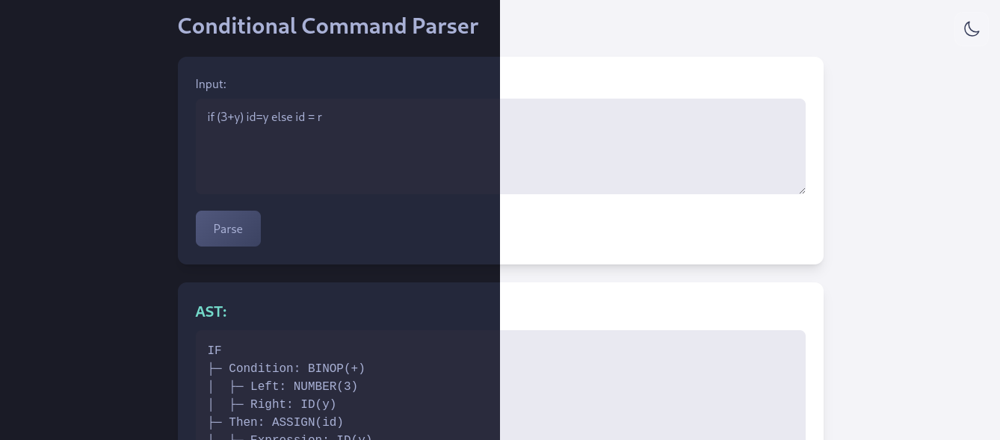
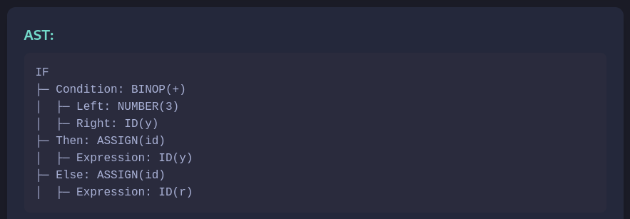

# 📚 ConditionalCommandParser – Conditional Command Parsing Utility


_Tokyo Night Theme (Dark & Light Modes)_

<div align="center">
  
  
  
  
</div>

## 🗂️ Table of Contents

- [⭐ Features](#-features)
- [📸 Screenshots](#-screenshots)
- [🏗️ Technical Implementation](#️-technical-implementation)
- [⚙️ Technologies](#️-technologies)
- [🚀 Getting Started](#-getting-started)
- [🧪 Testing](#-testing)
- [📜 License](#-license)
- [👥 Authors](#-authors)

---

## ⭐ Features

**A modular conditional command parsing utility with semantic analysis:**

- ✅ **Advanced Parsing Engine**

  - Implements a Recursive Descent Parser to handle conditional commands, assignments, and expressions with clear grammar structure.

- 🔍 **Custom Lexer & Grammar Analysis**

  - Robust Lexer for tokenization and type recognition (supporting `float`, `string`, `char`, and `int`).
  - First and Follow set calculations to support predictive parsing and error handling.
  - **Supports comments** in the input:
    - `// line comments`
    - `/* block comments */`

- 🧠 **Semantic Analysis**

  - Enforces semantic rules such as type consistency in assignments and expressions.
  - Symbol table management for identifier tracking and type binding.

- 🎨 **Syntax Tree Visualization**

  - TreePrinter utility provides a clear, labeled printout of the abstract syntax tree (AST), including node types and relationships.

- 🖥️ **Modern Web Interface**

  - Web controller (ParserController) and a responsive `index.html` interface styled with Tailwind CSS.
  - Includes light/dark themes inspired by the TokyoNight palette and a toggle switch for user preference.

- 🧪 **Test-Driven Development**

  - Extensive unit tests for Lexer, ParserService, Semantic Analysis, and FirstFollowCalculator ensure correctness and robustness.

---

## 📸 Screenshots

### Syntax Tree Visualization


_Visual output from TreePrinter displaying the parsed conditional command tree_

---

## 🏗️ Technical Implementation

### Grammar Specification

The parser is built using the following context-free grammar:

```bnf
S → if ( E ) S else S | id = E
E → E + T | E - T | T
T → T * F | T / F | F
F → ( E ) | id
```

**Note:** In this grammar:

- `id` represents either an **identifier** (e.g., variable names) or a **literal** of supported types: `float`, `string`, `char`, or `int`
- `if`, `else`, and operators (`+`, `-`, `*`, `/`) are terminal symbols

### Project Structure & Component Roles

```bash
src/
├── main
│   ├── java/br/edu/fesa/Conditional_Command_Parser
│   │   ├── ConditionalCommandParserApplication.java # Main Spring Boot entry point
│   │   ├── exception
│   │   │   ├── LexicalException.java               # Custom lexical error handling
│   │   │   ├── SemanticException.java             # Custom semantic error handling
│   │   │   └── SyntaxException.java               # Custom syntax error handling
│   │   ├── controller
│   │   │   └── ParserController.java              # REST API endpoint handler
│   │   ├── model
│   │   │   ├── Assignment.java                    # 'id = E' assignment nodes
│   │   │   ├── BinOp.java                         # Binary operations (+,-,*,/)
│   │   │   ├── CharLiteral.java                   # Char literal node
│   │   │   ├── FloatLiteral.java                  # Float literal node
│   │   │   ├── Identifier.java                    # ID nodes (variables/numbers)
│   │   │   ├── IfStatement.java                   # If-else control structures
│   │   │   ├── NumberLiteral.java                 # Numeric literal node
│   │   │   ├── ParserResponse.java                # API response wrapper
│   │   │   ├── StringLiteral.java                 # String literal node
│   │   │   ├── SyntaxNode.java                    # Base AST interface
│   │   │   └── Token.java                         # Token type/value storage
│   │   ├── semantic
│   │   │   ├── Symbol.java                        # Symbol representation for semantic analysis
│   │   │   └── SymbolTable.java                   # Symbol table for variable scope management
│   │   ├── service
│   │   │   └── ParserService.java                 # Core parsing logic orchestration
│   │   └── utils
│   │       ├── FirstFollowCalculator.java         # Grammar analysis utilities
│   │       ├── Lexer.java                         # Source code tokenization
│   │       ├── RecursiveDescentParser.java        # Syntax tree construction
│   │       ├── SemanticAnalyzer.java              # Semantic analysis for type checking
│   │       └── TreePrinter.java                   # AST visualization generator
│   └── resources
│       ├── application.properties                 # Spring configuration
│       ├── static
│       │   └── styles.css                         # TokyoNight theme styling
│       └── templates
│           └── index.html                         # Web interface template
└── test
    └── java/br/edu/fesa/Conditional_Command_Parser
        ├── ConditionalCommandParserApplicationTests.java
        ├── service
        │   └── ParserServiceTest.java             # Service layer tests (7 tests)
        ├── utils
        │   ├── FirstFollowCalculatorTest.java     # Grammar analysis tests (2 tests)
        │   ├── LexerTest.java                     # Tokenization tests (18 tests)
        │   ├── RecursiveDescentParserTest.java    # Recursive descent parser tests (14 tests)
        │   └── SemanticAnalyzerTest.java          # Semantic analysis tests (6 tests)
```

---

## ⚙️ Technologies

- **Backend**: Spring Boot 3.4.4 + Java 17
- **Frontend**: Thymeleaf + Tailwind CSS
- **Parsing Techniques**: Recursive descent parsing, custom lexer/tokenization, first/follow calculations
- **Build**: Maven 3.9+
- **Testing**: JUnit 5 (11 Total Tests)

---

## 🚀 Getting Started

### Prerequisites

- Java Development Kit (JDK) 17
- Maven 3.9+

### Installation

Clone the repository and build the project:

```bash
git clone git@github.com:Rutpiv/Conditional-Command-Parser.git
cd Conditional-Command-Parser
mvn clean install
```

### Running the Application

Start the application:

```bash
mvn spring-boot:run
```

Access the web interface at: 🌐 [http://localhost:8080](http://localhost:8080)

---

## 🧪 Testing

**Comprehensive validation coverage:**

```bash
mvn test
```

- ✅ **ParserService:** 7 tests ensuring correct parsing logic
- ✅ **FirstFollowCalculator:** 2 tests validating grammar analysis
- ✅ **Lexer:** 18 tests verifying tokenization accuracy
- ✅ **RecursiveDescentParser:** 14 tests for syntax tree generation
- ✅ **SemanticAnalyzer:** 6 tests validating type checking and symbol management

---

## 📜 License

Distributed under the **[BSD 3-Clause License](./LICENSE)**.

---

## 👥 Authors

Students from **Engenheiro Salvador Arena College**:
➡️ [Complete Contributors List](./AUTHORS)

---

<div align="center">
  <sub>Built with ♥ by Computer Engineering students</sub><br>
  <sub>Compilers Course Project • 2025 Semester</sub>
</div>
